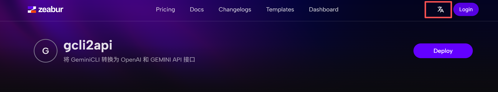

# gcli2api 云端部署自用教程

## 教程概述
本教程将教您如何使用 Zeabur 平台一键免费部署 gcli2api 服务。部署完成后，您就可以将已获取的 Gemini API 凭证文件（.json）供自己使用。

> **注意**：获取凭证文件请参考 [本地凭证获取教程](./本地凭证获取教程.md) 或 [云端凭证获取教程](./云端凭证获取教程.md)。

---

## 通过 Zeabur 平台一键免费部署 gcli2api 服务

### 1. 切换为中文界面 (可选)
如果您不熟悉英文，可以先将 Zeabur 的网站语言切换为中文，方便后续操作。


### 2. 进行注册
访问 [zeabur.com](https://zeabur.com) 并使用 GitHub 或 Google 账号注册。


### 3. 手机验证
首次注册可能需要进行手机号验证以激活账号。


### 4. 一键部署
登录后，点击下方按钮一键部署项目：
[](https://zeabur.com/templates/gcli2api)

### 5. 等待部署完成
点击“部署”后，系统将开始自动构建和部署。


### 6. 设置服务参数
在弹出的窗口中，设置以下参数：
- **PASSWORD**: 设置访问 gcli2api 页面的密码，请务必牢记。
- **SERVICE_DOMAIN**: 设置您的服务域名，可以自定义。
- **Region**: 服务区域。
  > **警告**: 请不要选择香港或美国东部服务器，因为这些地区无法正常使用 Google Gemini 服务。


### 7.等待部署完成
点击部署后，系统将开始自动化构建和部署。您可以点击“Go to Project”返回项目主页，等待服务状态变为绿色的“Running”。

部署成功后，即可访问您的域名，使用之前设置的密码登录，并上传您的 .json 凭证文件开始使用。

### 8. 可选：配置内存限制 (防止超额)
如果您的服务经常因内存超限而重启，可以在“变量”中添加以下环境变量来启用内存监控：
```
# 启用内存监控
AUTO_START_MEMORY_MONITOR=true

# 内存限制配置 (可选, 可根据需要添加)
MAX_MEMORY_MB=450
MEMORY_CHECK_INTERVAL=10
```
  > **注意**：达到内存限制可能导致服务无法工作，需要重启。要关闭此功能，可将 `AUTO_START_MEMORY_MONITOR` 设为 `false` 并重启，或重新部署。

### 9. 免费额度不够用？
如果免费额度用完，可以考虑在 Zeabur 购买付费服务。您可以根据自己的需求选择合适的服务器位置和规格。
